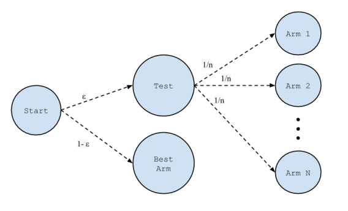
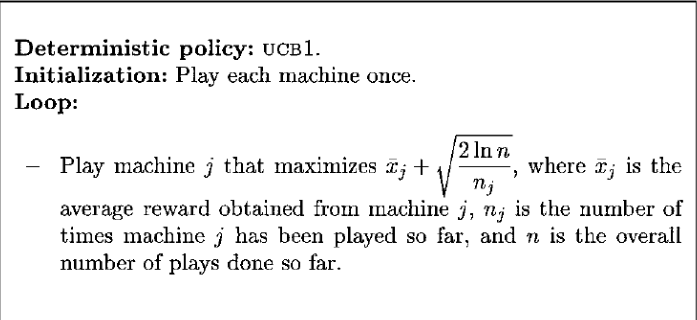
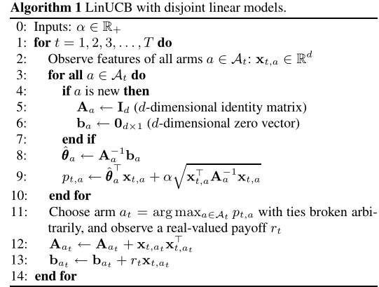
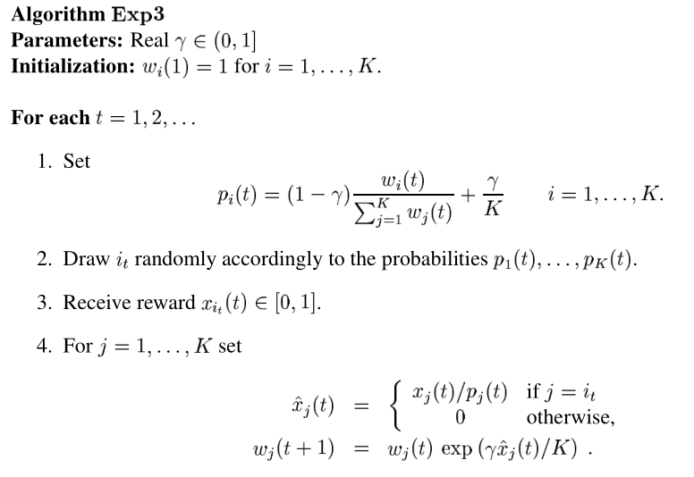
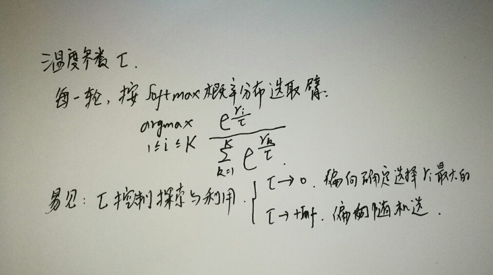
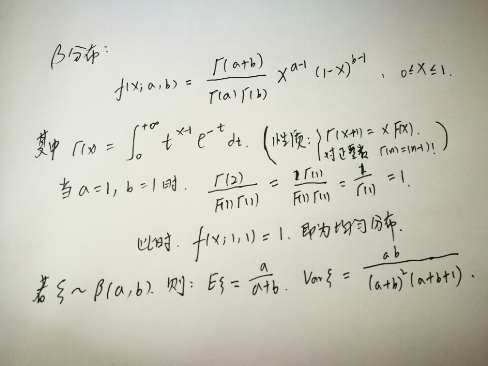
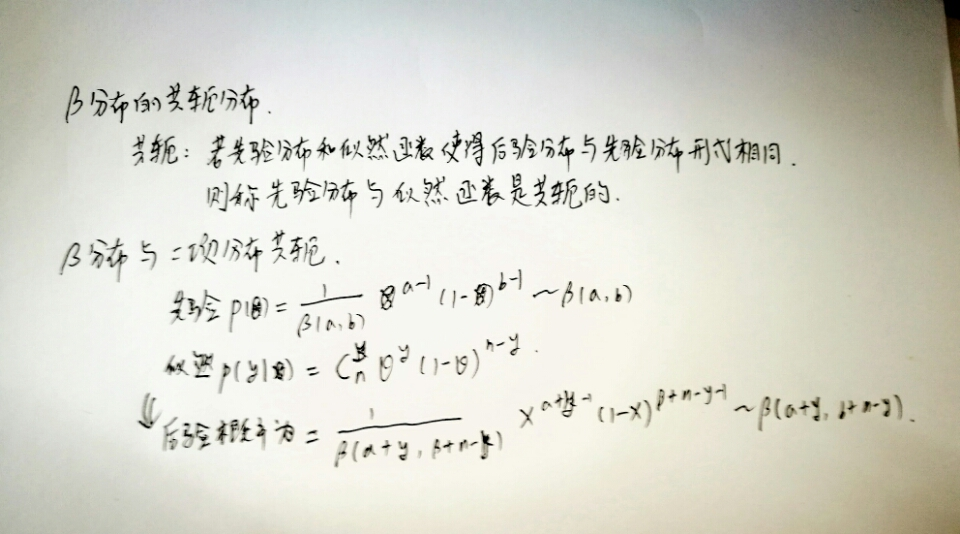
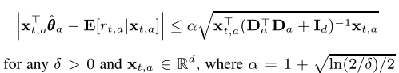
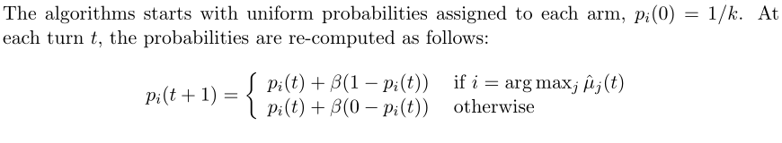
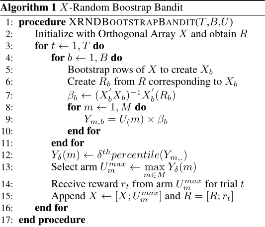

.. 策略

常用算法
=====

            |bandit|

.. |bandit| image:: imgs/thief.png

#. Epsilon-Greedy
    |epsilon|

    * 优点 简单直观
    * 缺点 随意启发，没有利用结构化信息（虽然可让 epsilon 递减，但利用的信息仍然有限）

#. UCB1
    |UCB1|

#. Softmax
    |softmax|

    其中，beta 是学习率参数

#. Pursuit

    |pursuit|

#. Thomas Sampling

    |beta|

    |beta_conjugate|

    |bayesian|

#. EXP3

    |exp3|

    .. autoclass:: policies.exp3.EXP3Policy

#. LinUCB

    上下文相关老虎机算法，即我们利用一些场外信息（附加上下文信息）来辅助决策。

    主要假设： 每个臂的回报的期望是上下文的线性函数(linear stochastic bandits)

    |linear_assumption|

    可以证明： 至少以概率 1-delta
    |bound|

    求解算法如下

    |LinUCB|

    disjoint: 不同臂的参数不共享

#. Bootstrap Bandit

     通过 Bootstrap 的方式，估计参数以及回报，取使得预估回报的某个分位点最大的臂

     |bootstrap|

     其中B为bootstrap次数，R为回报向量，X为特征矩阵，M为臂的个数，U为臂的集合

#. Collaborative Filtering with Bandit
    * CoLin
        Contextual Bandits in A Collaborative Environment(to read)
    * COFIBA
        Collaborative Filtering Bandits

.. 图片来源 http://blog.yhat.com/posts/the-beer-bandit.html

.. |bayesian| image:: imgs/bayesian.png

